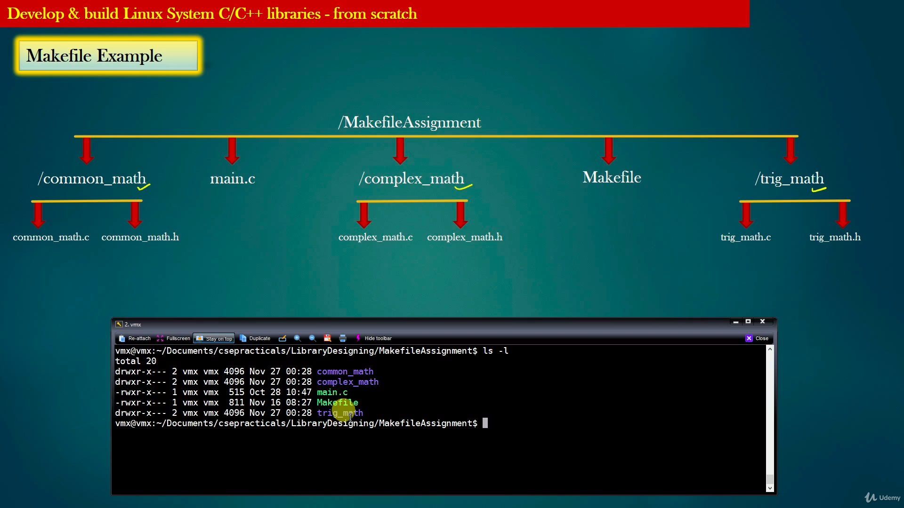

# Overview

- Since the advent of C/C++ Programming language, Memory management is one of the responsibility which the developer has to deal with 
 - C/C++ Softwares often suffers from Two Memory related Problems like
 - Memory corruption
 - Memory leak
 - Unlike Java, C/C++ do not have the luxury for automatic garbage collection
 - Java do not allow programmer to access the physical memory directly, but C/C++ does. Therefore Java applications do not suffer from Memory corruption either, but C/C++ do
 - In this project, we will design and implement memory leak detector (MLD) tool for C programs, easily extendible to C++ as well


#### Phase 1
- structure database creation
- It is the responsibility of the application to tell the MLD library during initialization about all structures it is using. This is called **structure registration**
- MLD library will maintain the structure database (preferably a linked-list) to store application structure information
- Key to search in structure database is “name of structure”

  
#### Phase 2
- Now, Its time that MLD libraries also knows about all objects the application has malloc’d
- Whenever the application malloc a new object, MLD library will store the relevant information about this object such as
- ➢➢  Corresponding structure details of the object
- ➢➢ Address of the object
- The object record holds the above information of the object
- Idea is, MLD library must have all information about all dynamic objects the application is using at any point of time
- MLD library maintains a database called **Object database** to keep track of all dynamic objects being used by the application


#### Heap memory Corruption:
-	Attempting to free memory already freed.
-	Freeing memory that was not allocated.
-	Attempting to read/write memory already freed.
-	Attempting to read/write to memory which was never allocated.
-	Memory allocation error.
-	Reading/writing to memory out of the bounds of a dynamically allocated array

#### Memory leak description: 

Memory is allocated but not released causing an application to consume memory reducing the available memory for other applications and eventually causing the system to page virtual memory to the hard drive slowing the application or crashing the application when than the computer memory resource limits are reached. The system may stop working as these limits are approached.


We will write our own calloc , lets call it xcalloc
``` void *
xcalloc (object_db_t *object_db, char *struct_name, int units );
Eg : emp_t * emp = xcalloc(object_db, “emp_t”, 1);
```
xcalloc does the following :
- Allocate “units” units of contiguous memory for object of type “struct_name”
-  Create the object record for new allocated object, and add the object record in object database
- Link the object record with structure record for structure “struct_name”
- Return the pointer to the allocated object
- Thus, xcalloc allocates memory for the object, but also create internal data structure in MLD Library so that MLD can keep track of the newly allocated object

### After Phase 1 and Phase 2
- MLD Library maintains two databases : Structure Database, and Object database
- Application register `all its structures` with MLD library at the time of initialization. This is one time process.
- Structure database should be `read-only database`, it need not be modified ever once populated
- Whenever the application xcalloc an object, object record entry is `inserted in object database`
- Object database keeps track of what `all objects are being used by the application`
- Now, that MLD has all the information it required to manipulate application objects, MLD library can do whatever it wants to do with application objects !


### Phase 3
- The purpose of MLD library is to process object database, with the help of structure database, and find Leaked application objects and report them
- We need to implement memory leak detection algorithm in MLD library to accomplish this goal


- Leaked objects are those objects which are not reachable from any other objects
- Finding the set of leaked objects is a graph problem
- ➢➢➢ Given a graph of nodes and edges, find all the nodes which are not reachable from any other
nodes
- Application objects have references to one another, overall, all application objects combined take the shape of a graph
- The graph can be disjoint – it can be set of isolated graphs
- Each Isolated Individual graph has a special node called root of the graph
- You application Data structures always takes the shape of disjoint set of graphs




# Makefile

TARGET:exe

#### common_math.o:common_math/common_math.c

	gcc -c -I common_math common_math/common_math.c -o common_math/common_math.o
 
#### complex_math.o:complex_math/complex_math.c

	gcc -c -I complex_math complex_math/complex_math.c -o complex_math/complex_math.o
 
#### trig_math.o:trig_math/trig_math.c

	gcc -c -I trig_math trig_math/trig_math.c -o complex_math/complex_math.o
	
#### libcalculator.a:trig_math/trig_math.o common_math/common_math.o complex_math/complex_math.o

	ar rs libcalculator.a common_math/common_math.o complex_math/complex_math.o trig_math/trig_math.o
 
#### exe.elf:main.o libcalculator.a

	gcc main.o -o exe.elf -L . libcalculator.a -lm
 
#### main.o:main.c

	gcc -c -I common_math -I complex_math -I trig_math main.c -o main.o
	
	

## -lm == <math.h>   == libmath.so
	
	
	
	
	
	
